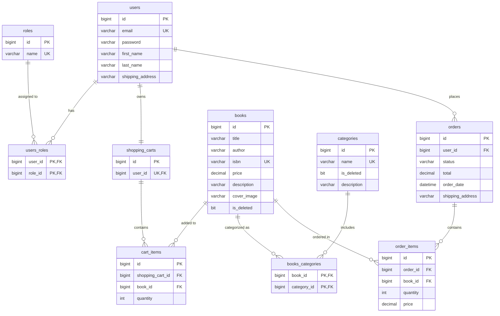

# Project Title

Book store application

## Description

This application is a backend implementation of an e-commerce bookstore, designed with a focus on security and clean architecture.

# Features:
* Authenticaton & Authorization: The app uses tokens (JWT) to secure endpoints. It is designed with two roles: 'ADMIN' and 'USER'. Each user has their own shopping cart and is able to make an order.
* Admin & User capabilities:
    * Admin can add, update, and manage books and categories.
    * User can view books, search by category, add items to the cart, and place an order.
* Validation: The application checks input data (for example, correct email format or non-empty fields) to prevent bad requests.
* Global Exception Handling: Errors are handled globally and return clear JSON messages.
* Testing: The project includes unit tests for controllers, services and repositories.
## Getting Started

### Dependencies

* Java 22
* Maven 3.8+
* MySQL Database
* OS: Windows, macOS, Linux

### Technologies

* Java 22
* Maven 3.8+
* MySql Database
* Spring Boot
* Spring Security
* JWT
* Spring Data JPA
* Hibernate
* Liquibase
* MapStruct
* Swagger / OpenAPI
* Docker
* JUnit 5
* Mockito

## Architecture
* Application architecture diagram: 

```mermaid
graph LR
    subgraph Client
        FE[Frontend / Postman]
    end

    subgraph "Book Store Application"
        C[Controller Layer]
        S[Service Layer]
        R[Repository Layer]
    end

    subgraph Data
        DB[(MySQL Database)]
    end

    FE -->|HTTP Request (JSON)| C
    C -->|Business Logic| S
    S -->|JPA/Hibernate| R
    R -->|SQL| DB
    DB -->|Entity| R
    R -->|DTO/Object| S
    S -->|Response| C
    C -->|HTTP Response| FE

    style C fill:#f9f,stroke:#333,stroke-width:2px
    style S fill:#ccf,stroke:#333,stroke-width:2px
    style R fill:#ff9,stroke:#333,stroke-width:2px
```

* Database relationship diagram: 



### Functionality

* AuthenticationController - registration and login,
- Permissions free
* BookController - CRUD operations, pagination and search,
- Requires 'ADMIN' to create, delete or update a book,
- Requires 'USER' or 'ADMIN' to get a book or page of books.
* CategoryController - category management,
- Requires 'ADMIN' to create, delete or update a category,
- Requires 'USER' or 'ADMIN' to get all categories, to get category by id,
- Requires 'USER' or 'ADMIN' to get books by category id.
* ShoppingCartController - cart items management,
- Requires 'ADMIN' or 'USER' to see shopping cart,
- Requires 'ADMIN' or 'USER' to add or delete cart item from the shopping cart,
- Requires 'ADMIN' or 'USER' to update cart item in the shopping cart.
* OrderController - placing orders, updating their statuses.
- Requires 'ADMIN' to update order status,
- Requires 'ADMIN' or 'USER' to get order item by id, get all order items,
- Requires 'ADMIN' or 'USER' to see a history of orders or place an order.


### Installing

1. Clone the repository:
```bash
git clone [https://github.com/PatrykWski/book-store-app.git](https://github.com/PatrykWski/book-store-app.git)
cd book-store-app/book-store
```

2. Configure your database in: src/main/resources/application.properties
```bash
spring.datasource.url=jdbc:mysql://localhost:3306/book_store_db?useSSL=false&serverTimezone=UTC
spring.datasource.username=root
spring.datasource.password=your_password
```

### Executing program

* Run the application via Maven:
```
mvn clean spring-boot:run
```
* Open Swagger UI to test the API:
```
http://localhost:8080/swagger-ui/index.html
```
## Help

Common problems or issues:
403 Forbidden in tests or requests: Make sure you are passing a valid JWT token or configured security context in your requests. In @WebMvcTest, handling Spring Security stateless filters can be tricky—ensure your authentication tokens are properly mocked.

Database connection error: Verify that your MySQL server is running and that the username and password in application.properties match your local setup.

## Authors

* @PatrykWski

## Version History

* 0.1
    * Initial Release - Added User Authentication, Book Catalog, and Shopping Cart features with full testing suite.

## License

This project is licensed under the MIT License.

## Acknowledgments
* [awesome-readme](https://github.com/matiassingers/awesome-readme)
* [PurpleBooth](https://gist.github.com/PurpleBooth/109311bb0361f32d87a2)
